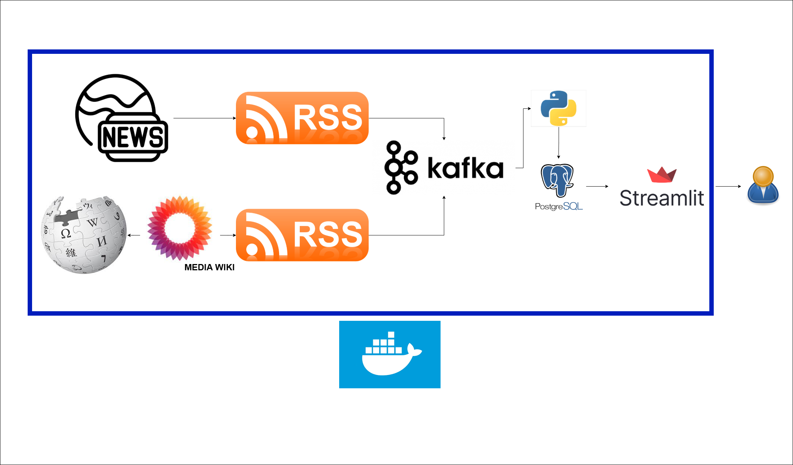

#  Trends-Realtime — Médias & Tendances en Direct

Surveillez **les flux RSS francophones** et **Wikipedia** , agrégés en temps réel via **Kafka + PostgreSQL + Streamlit**.

---

##  Architecture du Projet



### Composants Principaux
- **Producers**
  - `wiki_producer` → flux Wikipedia
  - `news_producer` → flux RSS + GDELT
- **Consumers**
  - `db_writer` → écrit dans PostgreSQL
  - `spike_aggregator` → calcule les tendances
- **UI**
  - `streamlit_app` → interface web temps réel

---
apercu : https://realtime-trend-4.onrender.com/
##  Démarrage Rapide

```bash
git clone https://github.com/yominax/trends-realtime.git
cd trends-realtime
docker compose up -d --build
   http://localhost:8501
 
